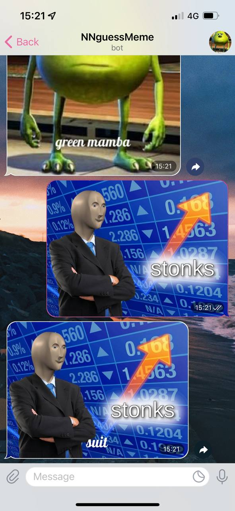

# NN Twitter Bot

This github repository is forked from the riscmkv NNTwitterBot repo which BASED and is yanderedev levels of spaghetti

In addition to the neural net that guesses memes this github repository provides a code for telegram bot that generates a pic with neural net prediction on a pic of your choice. 

## Initial NNTwitterBot readme

Neural net code can be found in resnext.py.

Twitter bot code can be found in twitterBotAPI.py. Authorization keys obviously not uploaded to github.

The file structure of the bot is poorly named:

- ./fan_submit: After the bot scrapes new messages, follower submissions are added to this folder
- ./submissions: This is where I add my own "curated" memes. It's not actually submissions.
- ./submissions_completed: After an image is posted, it is moved into this folder.

")
